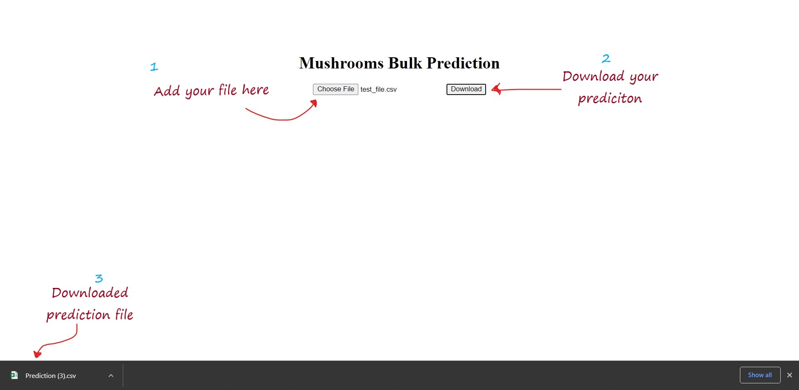

# Flask_Bulk_Prediction

Install all packages from requirements.txt using cmd pip install -r requirements.txt

The web appliction was made by using Flask you can run the flask file app.py using cmd python app.py 

